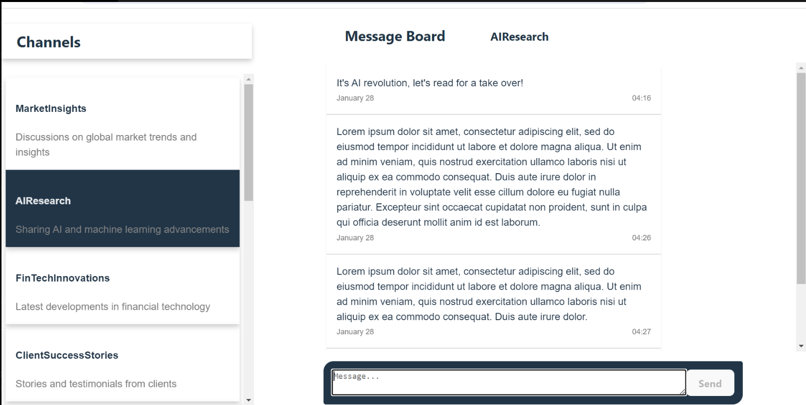

# Message Board Application

## Overview

The Message Board is a full-stack application that provides real-time communication across various channels. Leveraging WebSockets, it allows for live updates as users post messages. Designed with a responsive UI, it ensures a seamless experience across different devices and screen sizes.


<hr/>

## Key Features

- **Channel Selection**: Users can select from a predefined list of discussion channels.
- **Message Viewing**: Displays all messages within the selected channel.
- **Message Posting**: Users can post new messages to the selected channel, which appear in real-time.
- **Real-Time Updates**: Utilizes WebSockets for real-time broadcasting of new messages to all connected clients.

### Note:

- **All the the features were implemented as defined by the specifications of the Take-Home Javascript Assignment.**
- **I used websocket for broadcating posted messages from the backend so that it is available to all users in real-time. I wasn't sure about the specification regarding the availability of newly submitted message to all user(whether in real-time or once refreshed) So I did the implementation in real-time.**

## Technology Stack

- **Programming Language**: Typescript
- **Frontend**: React, CSS Modules for styling, `socket.io-client` for WebSocket communication.
- **Backend**: Node.js, Express for RESTful API, `socket.io` for WebSocket server, in-memory storage for channels and messages.

### Note:

**I used RestAPI for the backend and not GraphQL( which is used by AlphaSense) because I evaluated that the project and the data was simple and would not benefit much from the advantages offered by GraphQL.**

## Project Structure

Below is a simplified overview of the project's folder structure, highlighting the separation of the frontend and backend with their respective `package.json` files:

message-board/

├── server/ # Contains all backend-related code and configurations

│ ├── src/ # Source code for the server, including API endpoints and utilities

│ └── package.json # Manages backend dependencies and scripts

│
├── react-client/ # Houses the frontend React application

│ ├── src/ # Frontend source code, including components and context

│ └── package.json # Manages frontend dependencies and scripts

│
├── message-board-scripts/ # Utility scripts for development and production tasks

├── README.md # Documentation for the project

└── package.json # Root package.json for managing project-wide scripts

- **server/**: This directory is dedicated to the backend server, built with Node.js and Express. It includes the application's API endpoints, middleware, and any server utilities.
- **react-client/**: This directory contains the React-based frontend application, including all UI components, application state management with Context or Redux, and service calls to the backend.
- **message-board-scripts/**: Contains scripts that facilitate common development and production tasks, such as starting the server and client simultaneously for development.

- **package.json (root)**: Located at the root of the project, this `package.json` file manages project-wide scripts, such as those used for initiating both the server and client in a development environment, and any dependencies or configurations that are applicable across the entire project.

## Getting Started

### Prerequisites

- Node.js installed on your local machine (Node.js v20.11.0 and NPM version 10 were used in this project)
- Basic knowledge of React and Node.js

### Installations

To set up the project on your local machine:

1. After extracting the source code from the archiev that was submitted, navigate to the root directory `/message-board` of the project and install project dependencies.

2. Use the provided script to install dependencies for both the server and the client (**recommended**):

- ```bash
   npm run install-all
  ```

  or insstall the dependencies separately for the react-client and the server:

  - ```bash
    cd ./react-client
    npm install
    ```
    and
    ```bash
    cd ./server
    npm install
    ```

### Development

To start the development server for both the client and server, run the script below at the root of the project. Both the server and the client will be launched in separate cmd terminals(**Command Prompt or cmd is required**):

```bash
   npm run dev
```

Alternatively, manually open two separate terminals and run the scripts below from the project root:

**Server**

```bash
     npm run dev:server
```

**Client**

```bash
     npm run dev:client
```

### Production Build

Run the scripts below to create and run a production build of the client and the server:

**Server**

```bash
     npm run start:server
```

**Client**

```bash
     npm run start:client
```

## Usage

Once the servers are running, you can access the Message Board app through your web browser. Follow the instructions printed on console. The frontend url is _http://localhost:5173_

- **Select a Channel:** Click on a channel from the left sidebar to view its messages.
- **Post a Message:** Enter your message in the text area at the bottom and press "Send" to post it.
- **Real-Time Interaction:** Messages posted by any user will appear in real-time across all clients viewing the same channel.

### Server Endpoints

The backend server provides several RESTful endpoints for managing channels and messages within the Message Board application:

- **Channels**
  - `GET /channels`: Fetches a list of all available channels. Each channel includes an `id`(which is the unique name of the channel) and a `description`.
- **Messages**
  - `GET /messages/:channelId`: Retrieves all messages for a given channel specified by `channelId`.
  - `POST /:channelId`: Adds a new message to the specified channel. The request body should include the message content.
    - request body:
    ```json
    { "message": "message text" }
    ```
    - response body:
    ```json
    {
      "id": "unique number",
      "timestamp": "date string",
      "content": "message text"
    }
    ```

### Example Requests

- **Fetch Channels**
  ```bash
  curl -X GET http://localhost:3005/channels
  ```
- **Fetch Messages for a Channel**

  ```bash
  curl -X GET http://localhost:3005/messages/[channelId]

  ```

- **Fetch Messages for a Channel**

  ```bash
  curl -X POST http://localhost:3005/[channelId] -H "Content-Type: application/json" -d '{"message": "Hello, world!"}'

  ```

  _Ensure that your server is up and running before executing the requests._

## Testing

Due to the constraints of the submission deadline, a full suite of automated tests could not be implemented. However, the application has been manually tested to verify core functionality. Key features such as channel selection, message posting, and real-time updates have been thoroughly tested to ensure a smooth user experience.

### Manual Test Cases

- **Channel Selection**: Click on each channel and verify that the correct messages are displayed.
- **Post Message**: Enter a message and click "Send". The message should appear immediately in the message board.
- **Real-Time Updates**: Open two instances of the application, post a message in one, and verify that it appears in the other.

### Future Testing Plans

Given additional time, the following tests would be implemented:

- **Unit Tests**: For utility functions and individual components.
- **Integration Tests**: To test the server's RESTful API responses and WebSocket events.
- **End-to-End Tests**: Using Cypress to simulate real-user interactions and verify the application flow from start to finish.

The current codebase has been structured with testing in mind, and appropriate refactoring has been done to make the addition of tests straightforward in the future.

## Developer

- - Tamanji Che
- - tamanji.ambe@gmail.com
