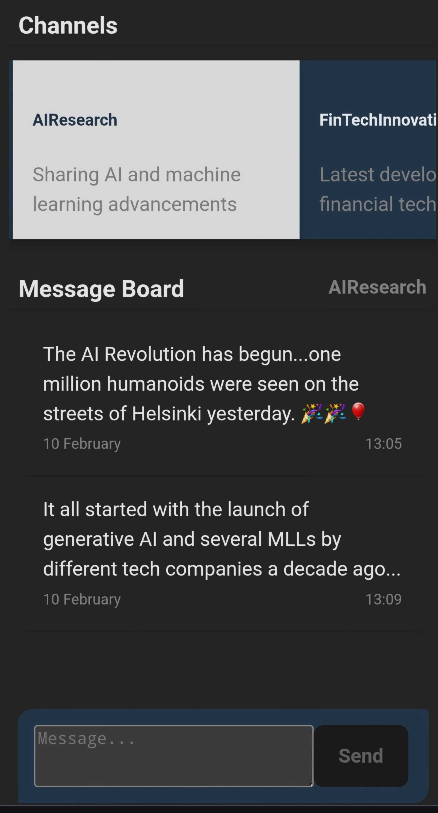
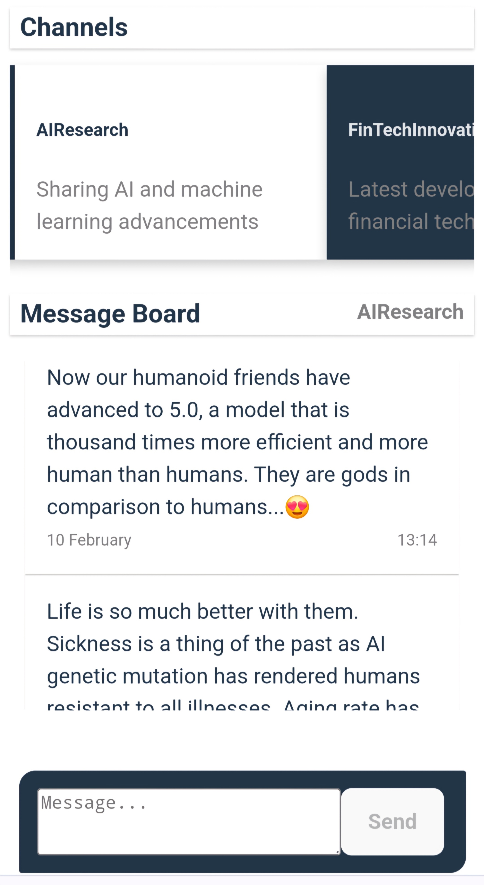
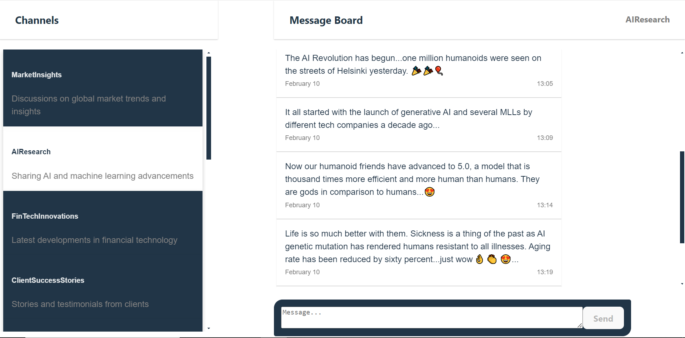

# Message Board <a href="https://messenge--board-64c5f8903fd9.herokuapp.com/">

</a>

## Overview

Message Board (prototype) is an application that provides real-time communication across various channels for a company. Leveraging WebSockets, it allows for live updates as users post messages. Designed with a responsive UI, it ensures a seamless experience across different devices and screen sizes.

<br/>
<div> 


</div>

<br/>


## Key Features

- **Channel Selection**: Users can select from a predefined list of discussion channels.
- **Message Viewing**: Displays all messages within the selected channel.
- **Message Posting**: Users can post new messages to the selected channel, which appear in real-time.
- **Real-Time Updates**: Utilizes WebSockets for real-time broadcasting of new messages to all connected clients.

## Technology Stack

- **Programming Language**: Typescript
- **Frontend**: React, CSS Modules for styling, `socket.io-client` for WebSocket communication.
- **Backend**: Node.js, Express for RESTful API, `socket.io` for WebSocket server, in-memory storage for channels and messages.

## Project Structure

Below is a simplified overview of the project's folder structure, highlighting the separation of the frontend and backend with their respective `package.json` files:

message-board/

```bash
   message-board/
├── server/                  # Backend server implementation
│   ├── src/                 # Server source code
├── react-client/            # Frontend React application
│   ├── src/                 # Client source code
│   └── package.json         # Frontend dependencies
├── message-board-scripts/   # Development and production utility scripts
├── README.md                # Project documentation
└── package.json             # Backend dependencies at the Root-level

```

- **`server/`**: This directory is dedicated to the backend server, built with Node.js and Express. It includes the application's API endpoints, middleware, and any server utilities.
- **`react-client/`**: This directory contains the React-based frontend application, including all UI components, application state management with Context, and service calls to the backend.
- **`message-board-scripts/`**: Contains scripts that facilitate common development and production tasks, such as starting the server and client simultaneously for development.

- **`package.json` (root)**: Located at the root of the project, this `package.json` file manages project-wide scripts, such as those used for initiating both the server and client in a development environment, and the backend dependencies for the project. In production, the client build is served as a static by the NodeJS server of Message Board.

## Getting Started

### Prerequisites

- Node.js installed on your local machine (Node.js v20.11.0 and NPM version 10 were used in this project)
- Basic knowledge of React and Node.js

### Installations

To set up the project on your local machine:

1.  Clone the project, navigate to the root directory `/message-board` of the project and install project dependencies.

2.  Use the provided script to install dependencies for both the server and the client (**recommended**):

```bash
 git clone "insert this git repo url here"
 cd /message-board                  # navigate to the root directory
 npm run install-all                # installs both client and server deps
```

or insstall the dependencies separately for the react-client and the server:

```bash
 cd ./react-client
 npm install

 # At the root of the project to install server dependencies (/message-board)
 npm install
```

### Development

To start the development server for both the client and server, run the script below at the root of the project. Both the server and the client will be launched in separate cmd.exe terminals(**Command Prompt or cmd is required**):

```bash
   npm run dev
```

Alternatively, manually open two separate terminals and run the scripts below from the project root:

**Server**

```bash
     npm run dev:server
```

**Client**

```bash
     npm run dev:client
```

### Production Build

Run the scripts below to create and run a production build of the client and the server:

**Server**

```bash
     npm run build && npm start
```

## Usage

Once the servers are running, you can access the Message Board app through your web browser. Follow the instructions printed on console. The frontend url is `http://localhost:5173`

- **Select a Channel:** Click on a channel from the left sidebar(Desktop view) to view its messages.
- **Post a Message:** Enter your message in the text area at the bottom and press "Send" to post it.
- **Real-Time Interaction:** Messages posted by any user will appear in real-time across all clients viewing the same channel.

### Server Endpoints

The backend server provides several RESTful endpoints for managing channels and messages within the Message Board application:

- **baseUrl:** **`/api`**
- **Channels**
  - `GET /channels`: Fetches a list of all available channels. Each channel includes an `id`(which is the unique name of the channel) and a `description`.
- **Messages**
  - `GET /messages/:channelId`: Retrieves all messages for a given channel specified by `channelId`.
  - `POST /:channelId`: Adds a new message to the specified channel. The request body should include the message content. **Posted messages are published in real-time by the server to all clients connected to the server websockect**
    - request body:
    ```json
    { "message": "Your message" }
    ```
    - response body:
    ```json
    {
      "id": "unique number",
      "timestamp": "date string",
      "content": "Your message"
    }
    ```

### Example Requests

- **Fetch Channels**
  ```bash
  curl -X GET http://localhost:3005/api/channels
  ```
- **Fetch Messages for a Channel**

  ```bash
  curl -X GET http://localhost:3005/api/messages/[channelId]

  ```

- **Fetch Messages for a Channel**

  ```bash
  curl -X POST http://localhost:3005/api/[channelId] -H "Content-Type: application/json" -d '{"message": "Hello, world!"}'

  ```

  _Ensure that your server is up and running before executing the requests._

## Developer

- Tamanji Che
- https://www.linkedin.com/in/tamanji/
